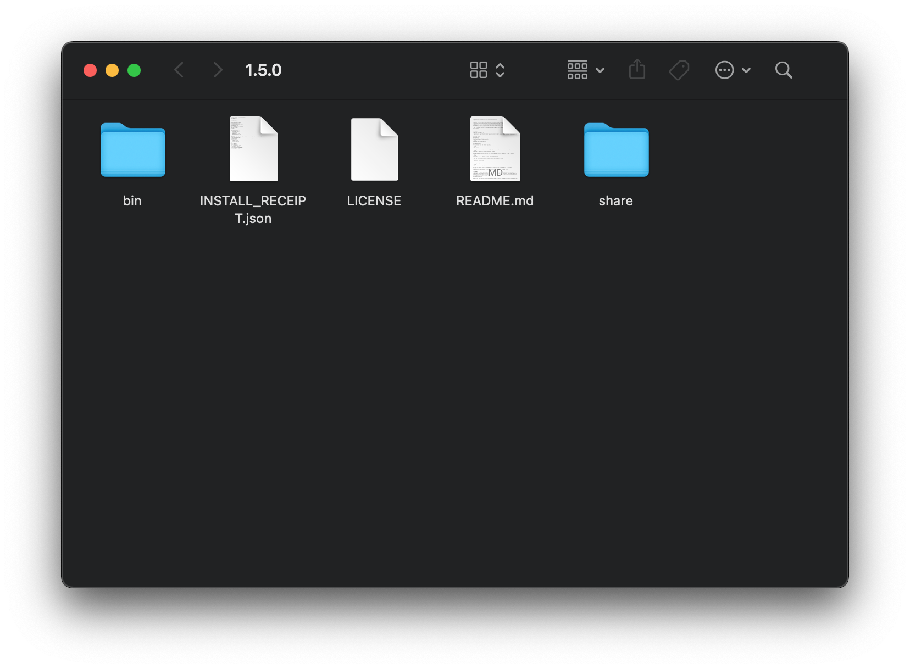

# homebrew-keg

[](https://github.com/marcransome/homebrew-keg/issues) [](https://opensource.org/licenses/mit-license.php)

`homebrew-keg` is a tiny [external command](https://docs.brew.sh/External-Commands) for the [Homebrew](https://brew.sh) package manager that opens the keg directory for a formula in a Finder window or prints the keg path to the shell.

<hr>

## Getting started

### Installation

Install with [Homebrew](https://brew.sh):

```bash
brew tap marcransome/keg
```

## Opening a keg

To open the keg for a locally installed formula in a Finder window:

```
brew keg <formula>
```

For example:

```
brew keg flog
```

Which opens the keg directory for the [flog](https://github.com/marcransome/flog) formula:



## Print the keg path

To print the keg path for a formula:

```
brew keg --path <formula>
```

For example:

```
brew keg --path flog
```

Prints:

```
/usr/local/Cellar/flog/1.5.0
```

## Acknowledgements

* Keg icon made by [Freepik](https://www.flaticon.com/authors/freepik) from [www.flaticon.com](https://www.flaticon.com/)

## License

`homebrew-keg` is provided under the terms of the [MIT License](https://opensource.org/licenses/mit-license.php).

## Contact

Email me at [marc.ransome@fidgetbox.co.uk](mailto:marc.ransome@fidgetbox.co.uk) or [create an issue](https://github.com/marcransome/homebrew-keg/issues).
